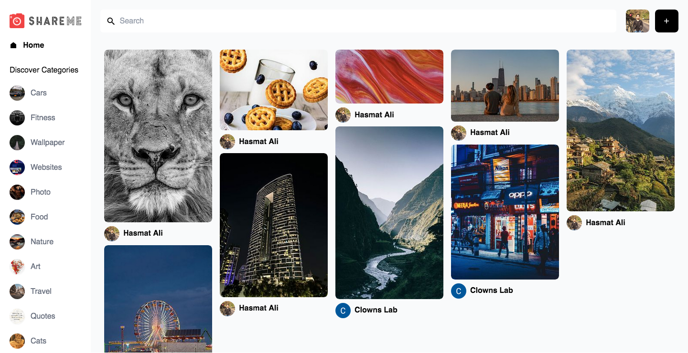

# ShareMe Web Application

Users should be able to:

- Signin and Signout with google.
- Add, delete and save images
- Search option
- Display images based on categories
- Connect to Sanity database and fetch data from Sanity dashboard
- create a custom post through custom dashboard

### Screenshot

- Live Site URL: [Click Here](https://shareme-react-vite.netlify.app/)

### Built with

- TailWind CSS
- React
- Sanity

## Acknowledgments

Thanks to JavaScript Mastery for creating the tutorail on YouTube.
